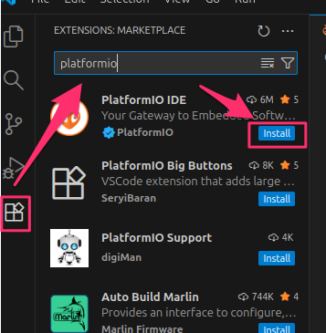
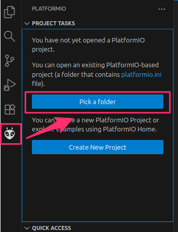
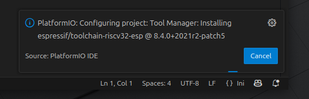
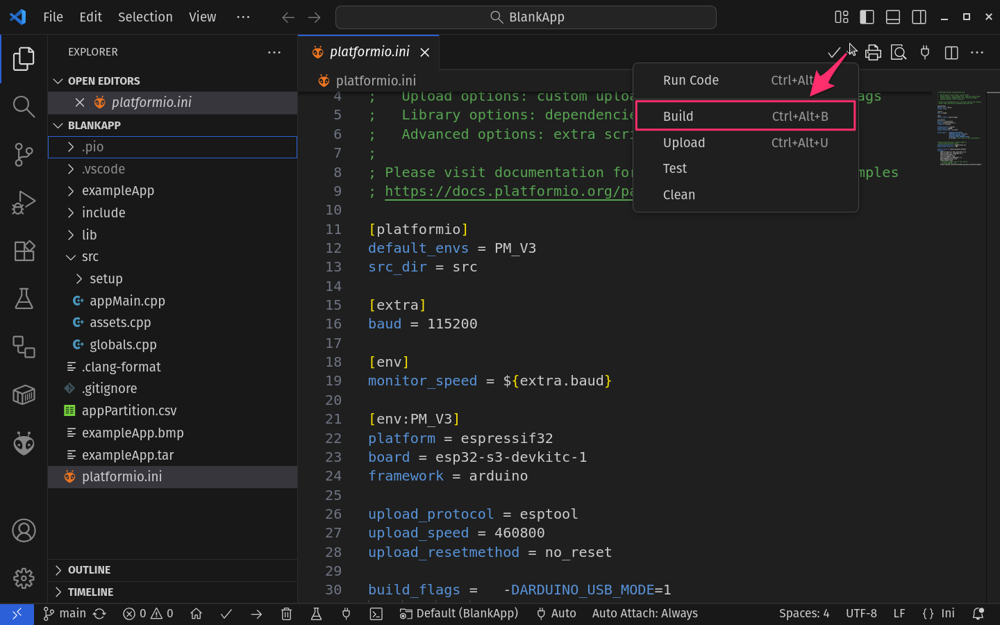

# Setting Up a Pocket Mage Build Environment
## Prerequisites
- VS Code is installed.
- python3 is installed.
- You have a directory with the Pocket Mage source code. This could be directly cloned from the main repo.  If you plan on contributing back (and you should) this will be simplified if you first fork the repo and then clone from your own fork.
# Set up a Linux Build Environment

The Pocket Mage project has some information about building the project [in this video](https://www.youtube.com/watch?v=3Ytc-3-BbMM). However, there are some assumptions about what you have provisioned that will probably not be true for most viewers. These are the steps to get a functioning PlatformIO environment such that at 1:04 when he says "We're just going to hit this button" you have a button to hit.

1. Note: This step is for **Linux only**. Probably most people who want to build Pocket Mage already have python3 but my Pop_OS Linux Laptop  did not have python3-venv by default. I used [these directions](https://github.com/platformio/platformio-core-installer/issues/85) to get that installed.
2. You will need the [PlatformIO IDE](https://docs.platformio.org/en/latest/integration/ide/vscode.html#ide-vscode) extension installed in your VS Code. In the Extensions marketplace, search for "PlatformIO IDE" and install it. This will take a little bit of time. After it completes you will be instructed to restart VS Code. 
3. Mark the directory you want to build as a PlatformIO Project. 
	- Click the "Pick a Folder" option. You will need an existing platformio.ini config file for this to work. For the first time, try selecting the "BlankApp" folder. 
    
    

	- Based on the values of the configuration, many packages will be installed. I found that this took some time with my computer and internet speeds. Expect this to be a good point for a beverage or maybe a meal.

    
 
4. Now you can build, by using the drop-down at the upper right.  

5. Verify that your environment is working by buildlng either BlankApp or PocketMage_V3. For either, the first compilation will be significantly slower as it builds all the object files for the libraries. Subsequent builds will be much faster.

## Setting up a Macintosh Build Environment

I was able to build both apps using the same directions as Linux.

## Setting up a Windows Build Environment

I was able to build on Windows. However I first had to install Git in order to clone the repository. I initially installed GitHub Desktop but still needed to install Git in order for VS Code to be able to manage the repository. Otherwise the directions above worked.